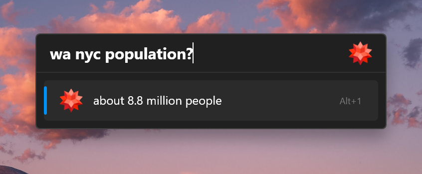

A [Flow Launcher](https://github.com/Flow-Launcher/Flow.Launcher) plugin to get short textual answers using [Wolfram|Alpha Short Answers API](https://products.wolframalpha.com/short-answers-api/documentation/).

> [!WARNING]
> This is an early version of the plugin, it may not work as expected. 

Currently, the plugin is not available in the Flow Launcher plugin store. you can install it manually by running the following command in Flow Launcher:

```
pm install https://github.com/adielBm/Flow.Launcher.Plugin.WolframAlpha/releases/latest/download/Flow.Launcher.Plugin.WolframAlpha.zip
```

You have to get an **App ID** from https://developer.wolframalpha.com/access and set it in the plugin settings. (free access for up to 2,000 API calls per month), otherwise, the plugin will use the default App ID `DEMO`.

- **Default keyword**: `wa`
- **Usage**: `wa <query>?` or `wa <query>!`
- **Example**: `wa what is the capital of France?`

## Screenshot


